# 🚀 SkillBridge AI

<div align="center">

## AI-Powered Resume Intelligence Platform

Analyze resumes against job descriptions, calculate ATS compatibility scores, identify skill gaps, and generate personalized career recommendations.

[](https://www.python.org/)
[](https://fastapi.tiangolo.com/)
[](https://streamlit.io/)
[](https://render.com/)


**🌐 Live Frontend:** https://skillbridge-ai-frontend-2loi.onrender.com  
**⚙️ Backend API:** https://skillbridge-ai-backend-mn6t.onrender.com  
**📚 API Docs:** https://skillbridge-ai-backend-mn6t.onrender.com/docs  
**💻 Repository:** https://github.com/rishh19/SkillBridge_AI

</div>

---

## 📑 Table of Contents

1. Overview
2. Why SkillBridge AI
3. Features
4. Technology Stack
5. System Architecture
6. Workflow
7. Folder Structure
8. Installation
9. Running Backend
10. Running Frontend
11. API Documentation
12. ATS Scoring Methodology
13. Recommendation Engine
14. Analytics Dashboard
15. Screenshots
16. Deployment
17. Future Enhancements
18. Learning Outcomes
19. Author
20. Support
21. Acknowledgements

# 📌 Project Overview

SkillBridge AI is a modular Resume Intelligence Platform built with **FastAPI** and **Streamlit**. The project extracts structured information from resumes, compares it with a target job description, calculates an ATS compatibility score, highlights missing skills, and produces personalized recommendations.

The architecture is intentionally modular so each stage—parsing, profile generation, matching, scoring, and recommendations—can evolve independently.

# 🎯 Why SkillBridge AI?

- Automates resume screening.
- Provides recruiter-style ATS insights.
- Identifies missing technical skills.
- Highlights resume strengths.
- Supports career planning.
- Uses a clean REST API architecture.
- Easy to deploy and extend.
- Designed as a portfolio-quality software engineering project.

# ✨ Key Features

- Resume Parsing
- Candidate Profile Extraction
- Skill Extraction
- Education Extraction
- Experience Extraction
- Project Extraction
- Certificate Extraction
- Resume vs Job Description Matching
- ATS Compatibility Score
- Missing Skill Detection
- Critical Skill Analysis
- Personalized Recommendations
- Interactive Dashboard
- REST API
- Cloud Deployment
- Modular Architecture
- Responsive Streamlit UI
- Reusable Backend Services

# 🛠 Technology Stack


| Category | Technology |
|---|---|
| Language | Python |
| Backend | FastAPI |
| Frontend | Streamlit |
| Libraries | Pandas, NumPy, PyMuPDF, Requests |
| Deployment | Render |
| Version Control | Git & GitHub |


# 🏗 System Architecture


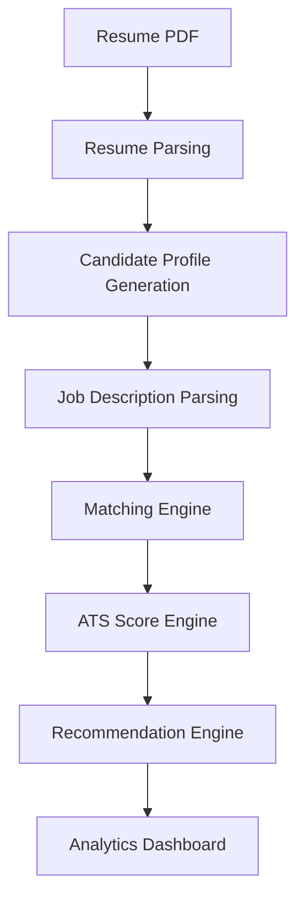


# 🔄 Workflow

1. Upload Resume PDF
2. Provide Job Description
3. Parse Resume
4. Extract Candidate Information
5. Parse Job Description
6. Match Skills
7. Calculate ATS Score
8. Detect Missing Skills
9. Generate Recommendations
10. Display Analytics Dashboard

# 📂 Folder Structure


```text
SkillBridge_AI/
├── backend/
│   ├── services/
│   ├── models/
│   ├── data/
│   └── main.py
├── frontend/
│   ├── assets/
│   ├── components/
│   ├── utils/
│   └── app.py
├── docs/
├── test_files/
├── test_resumes/
├── requirements.txt
└── README.md
```

# ⚙ Installation


```bash
git clone https://github.com/rishh19/SkillBridge_AI.git
cd SkillBridge_AI
python -m venv skillbridge_venv

# Windows
skillbridge_venv\Scripts\activate

# Linux/macOS
source skillbridge_venv/bin/activate

pip install -r requirements.txt
```


# ▶ Running Backend


```bash
cd backend
uvicorn main:app --reload
```

Local URL: http://127.0.0.1:8000


# ▶ Running Frontend


```bash
cd frontend
streamlit run app.py
```

Local URL: http://localhost:8501


# 📡 API Documentation


## GET /

```json
{"message":"Welcome to SkillBridge AI API"}
```

## POST /analyze

### Input

- Resume PDF
- Job Description

### Output

- ATS Score
- Skill Match
- Missing Skills
- Candidate Profile
- Personalized Recommendations


# 📊 ATS Scoring Methodology


The ATS score is calculated using multiple weighted dimensions including:

- Skill Match
- Critical Skill Coverage
- Education Alignment
- Experience Relevance
- Project Relevance
- Certifications
- Resume Completeness

The weighted result provides a recruiter-friendly compatibility score.


# 💡 Recommendation Engine


Recommendations are generated by comparing extracted resume information against job requirements.

Typical recommendation categories:

- Missing Skills
- Resume Improvements
- Project Suggestions
- Learning Priorities
- Interview Preparation Tips


# 📈 Analytics Dashboard


Dashboard panels include:

- ATS Score Card
- Candidate Summary
- Skill Match
- Missing Skills
- Recommendation Cards
- ATS Breakdown Visualization
- Interactive Analysis


# 📸 Screenshots

### 01 Home Page

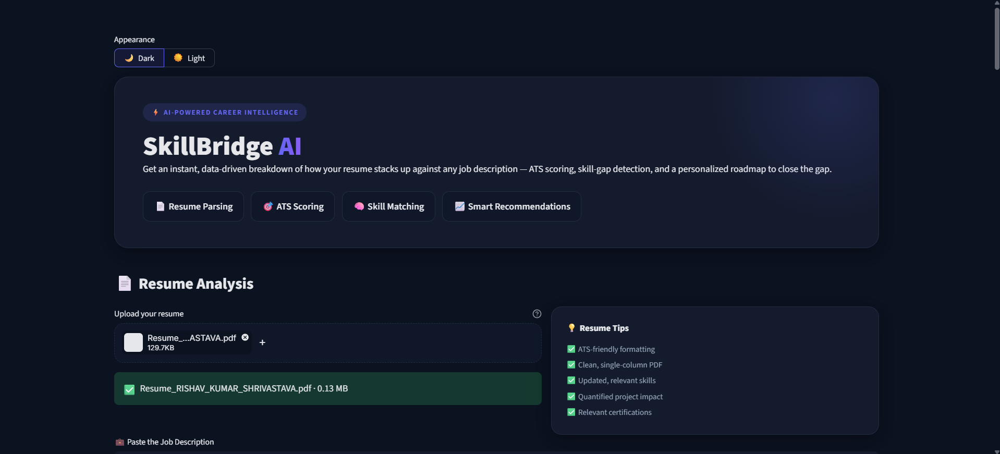

### 02 Resume Upload

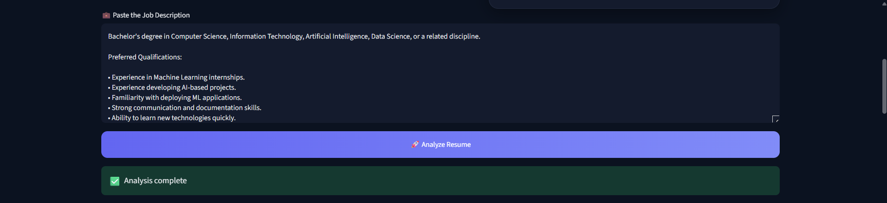

### 03 Job Description Input

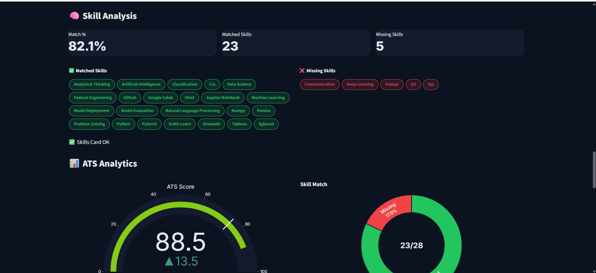

### 04 Analysis Dashboard

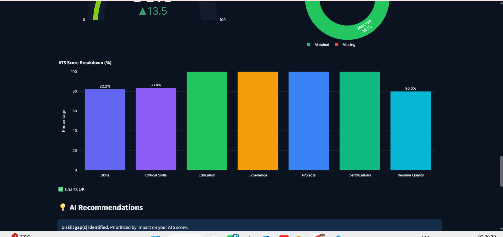

### 05 Skill Analysis

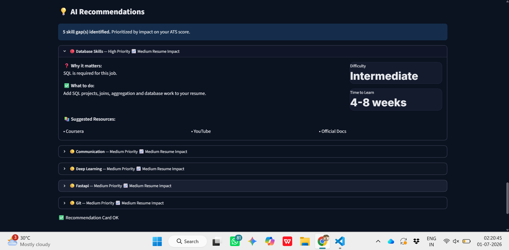

### 06 ATS Analytics

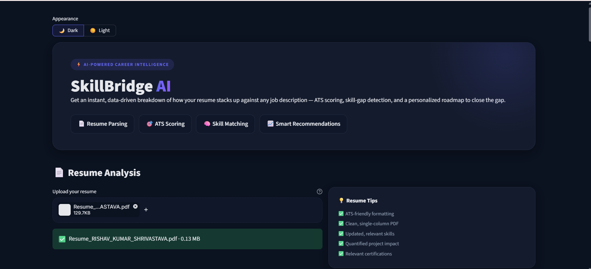

### 07 AI Recommendations

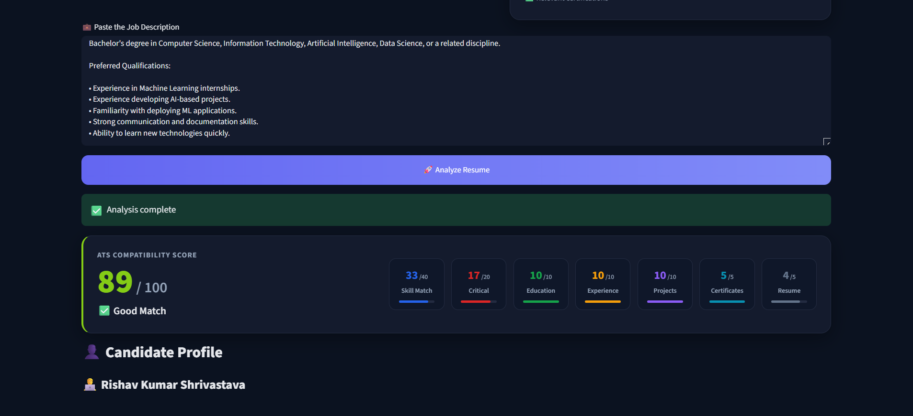

### 08 Frontend Developer Analysis

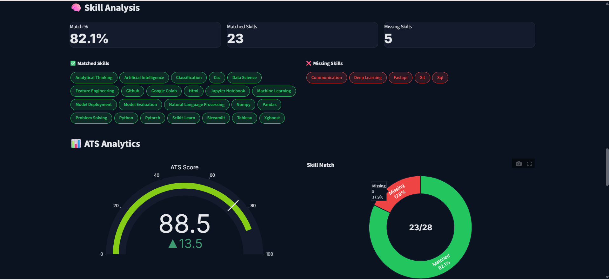

### 09 Frontend Skill Gap

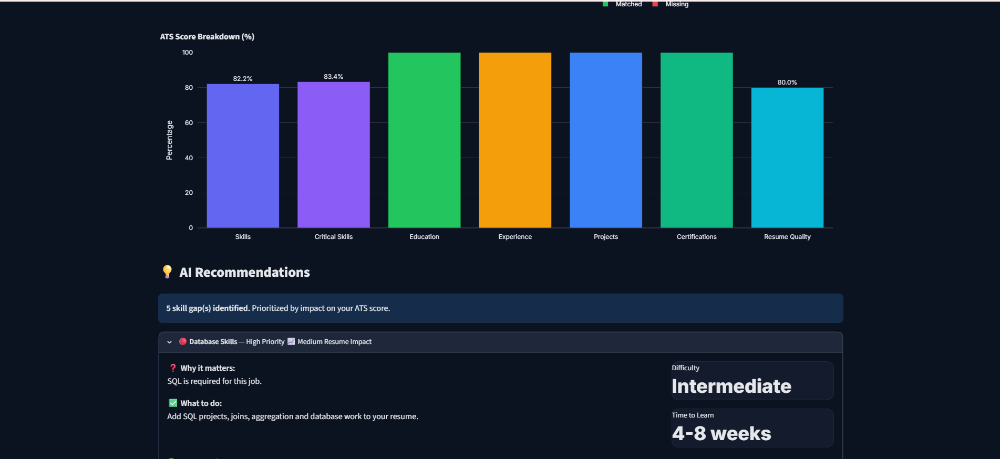

### 10 Frontend Recommendations

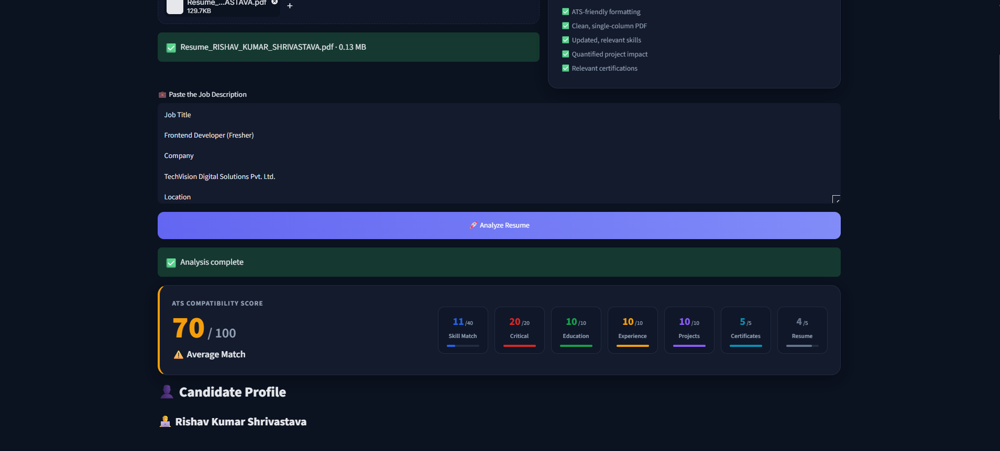

### 11 Project Footer

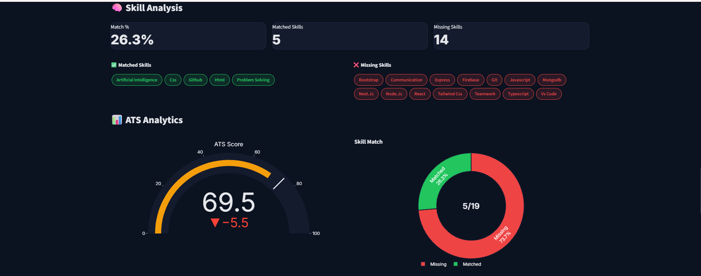

### 12 Recommendation Accordion

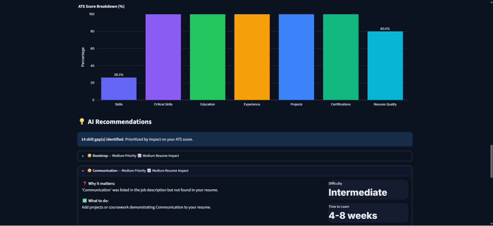

### 13 ATS Breakdown Chart

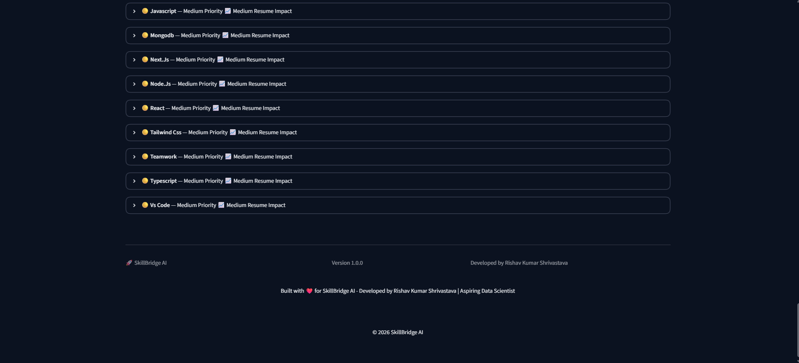


# 🚀 Deployment


- Frontend deployed on Render.
- Backend deployed on Render.
- Source code hosted on GitHub.
- Interactive API documentation available through FastAPI docs.


# 🔮 Future Enhancements

- Docker
- AWS Deployment
- Authentication
- Resume History
- LLM Integration
- Chat Assistant
- PDF Report Export
- Resume Comparison
- CI/CD Pipeline
- Database

# 🎓 Learning Outcomes

- FastAPI
- Streamlit
- REST APIs
- Resume Parsing
- Software Architecture
- Git
- GitHub
- Cloud Deployment
- Modular Python Development

# 👨‍💻 Author


**Rishav Kumar Shrivastava**

B.Tech Computer Science Engineering

KIIT University

GitHub: https://github.com/rishh19

# ❤️ Support

If you found this project useful, please consider giving it a ⭐ on GitHub.

# 🙏 Acknowledgements


Special thanks to the open-source communities behind Python, FastAPI, Streamlit, Pandas, NumPy, PyMuPDF, Requests, Git, GitHub, and Render.


---

<div align='center'>

### Thank you for visiting SkillBridge AI ❤️

Made with Python, FastAPI, Streamlit and ☕.

</div>
